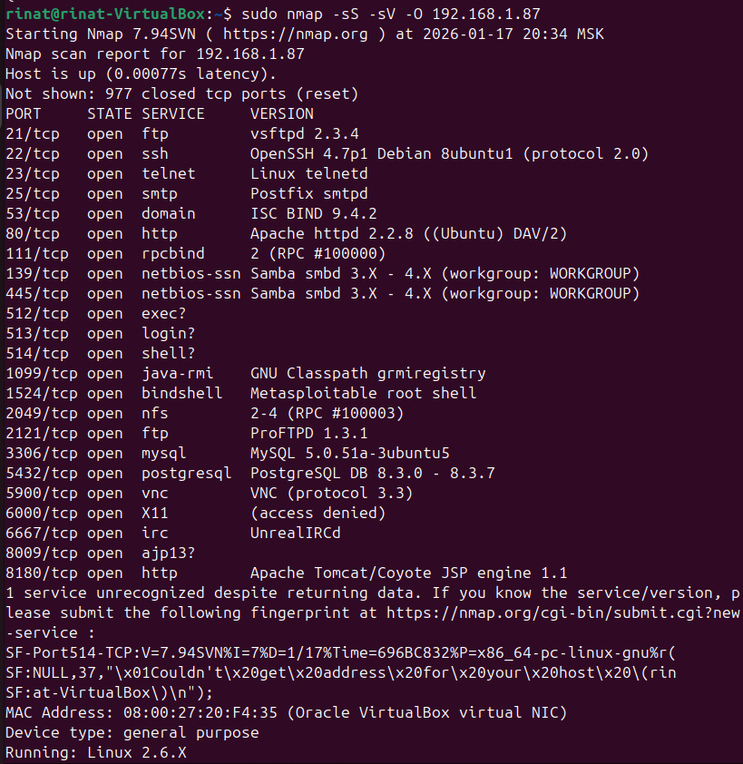

# Домашнее задание к занятию "`Уязвимости и атаки на информационные системы`" - `Серкебаев Ринат`

### Задание 1 

Скриншот вывода найденных сетевых служб, открытых портов и их версии

были найдены следующие уязвимости:
бэкдор уязвимость для vsftpd 2.3.4 - https://www.exploit-db.com/exploits/49757
бэкдор уязвимость для UnrealIRCd - https://www.exploit-db.com/exploits/13853
уязвимость запуска команды удаленно для ProFTPd 1.3.1 - https://www.exploit-db.com/exploits/15449

### Задание 2

Отличие SYN, FIN, Xmas, UDP с точки зрения сетевого трафика заключаются в следующем:
SYN отправляет TCP SYN, сервер отвечает SYN-ACK если порт открыт, соединение не завершается, заметен в трафике
FIN отправляет TCP FIN без установленного соединения, открытый порт игнорируется, закрытый порт отвечает RST, используется для обхода файрволлов
Xmas отправляет UDP пакеты, если порт закрыт, то ICMP Port Unreachable, если порт открыт, то зачастую ответа нет, сканирование медленное

Как отвечают сервера? 
SYN - ответ SYN-ACK или RST
FIN, Xmas - RST от закрытых портов, молчание от открытых
UDP - ICMP error или отсутствие ответа

